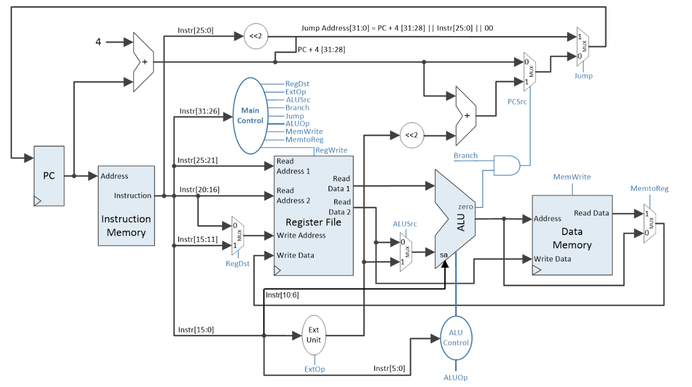

# MIPS single-Cycle processor

## Description
An implementation of a [**16bit** MIPS single-cycle](./Media/MIPS32_single_layout.png) processor in [Vivado](https://www.xilinx.com/products/design-tools/vivado.html) (hardware programming language).

The project was implemented for the Module **Computer Architecture**.

## Usage
Given a (at the moment) hardcoded binary code, it maps the project on the FPGA chip and executes it. The current
instruction (in hexadecimal value) is displayed on a Seven Segment Display (SSD).

## Hardware
In order to test the project, a [Nexys 3 FPGA Board](https://digilent.com/reference/programmable-logic/nexys-3/start) was used.

## Modules
- `Media`: a picture of the MIPS layout*
- `test_env.srcs`:
  - `sources_1`:
    - `new`:
      - here are all the necessary components described in VHDL.
- `raport_RO.pdf`: a description of the project functionalities and the test code in both C and MIPS-Assembly
- all other folders: were created by Vivado for the project to work.

> *even though the layout depicts a 32bit system, the implementation was on 16bit.
> The number of bits in this instance represents the (fixed) length of instructions in binary.